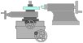
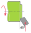

<!-- *** GUIDE START *** -->

La herramienta se ubica a la altura del punto lo más exacto posible. Si esto no está bien verás que cuesta más frentear la pieza y aparece un pupito en el centro.

::: figure
{width=350px}
:::

El frenteado consiste en sacar material del frente de la pieza. Para esto se coloca la herramienta en un ángulo aproximado de 45 grados.

::: figure
{width=250px}
:::

## Actividad

::: activity

**1.** Practica colocar la herramienta en el torno de forma correcta. Luego dibuja un esquema mostrando el posicionado correcto de la herramienta. Puedes guiarte de la figura y simplificarla un poco de modo que solo aparezca la torre portaherramienta, la herramienta, el punto.

**2.** Haz un dibujo mostrando la posición de la herramienta para el frenteado. Explica por que la herramienta solo le mueve hasta la mitad de la pieza.

:::
<!-- *** GUIDE END *** -->

<!-- *** GUIDE AUXILIARY THINGS *** -->

<!--

● Sections: example, activity. soluciones, img-foot, warning, note

::: example
### Ejemplo: Cálculo de derivadas
Aquí va el contenido de tu ejemplo. Puedes usar Markdown normal adentro.
:::

● Image:

::: figure
{width=400px}

<small>Pie (Source)</small>
:::

[⌕](../../images/ ) 

● Videos:

 Change XXX to video-id and put time in seconds

 - Yotube with start point: [Mira este momento clave en el video](https://www.youtube.com/watch?v=XXX&t=123s)

 - Youtubetrimmer with start and end point: [Mirá este momento puntual del video](https://youtubetrimmer.com/view/?v=XXX&start=120&end=150&loop=0)

-->
