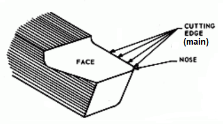
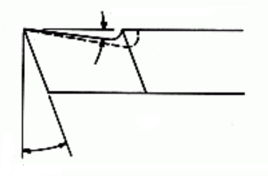

<!-- *** GUIDE START *** -->

La herramienta de corte usada normalmente en nuestro taller es de acero rápido. Está afilada de modo que tiene una arista llamada filo principal (indicado en la figura de abajo) y otra arista llamada filo secundario.

::: figure
{width=300px}
:::

La herramienta también presenta unos ángulos característicos que son:

* **Ángulo de incidencia:** evita que la herramienta roce contra la pieza.
* **Ángulo de desprendimiento:** facilita la salida de la viruta.
* **Radio de punta:** redondeo de la punta que influye en la resistencia del filo y en el acabado.

## Actividad

::: activity

**a)** Dibuja la herramienta, parecido al dibujo de arriba, señalando el filo principal y el secundario (este último falta en la figura)

**b)** Dibuja una vista de perfil de la herramienta, como la mostrada abajo, señalando el ángulo de incidencia y el de desprendimiento de viruta.

::: figure
{width=300px}
:::

**c)** Explica al profesor oralmente con una herramienta real en la mano cuales son los filos y cuales son los ángulos.

:::

<!-- *** GUIDE END *** -->

<!-- *** GUIDE AUXILIARY THINGS *** -->

<!--

● Sections: example, activity. solutions, figure, warning, note

::: example
### Ejemplo: Cálculo de derivadas
Aquí va el contenido de tu ejemplo. Puedes usar Markdown normal adentro.
:::

● Image:

::: figure
{width=400px}

<small>Pie (Source)</small>
:::

[⌕](../../images/ ) 

● Videos:

 Change XXX to video-id and put time in seconds

 - Yotube with start point: [Mira este momento clave en el video](https://www.youtube.com/watch?v=XXX&t=123s)

 - Youtubetrimmer with start and end point: [Mirá este momento puntual del video](https://youtubetrimmer.com/view/?v=XXX&start=120&end=150&loop=0)

-->
