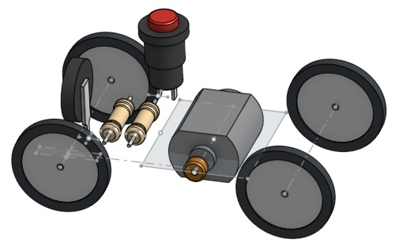

<!-- *** GUIDE START *** -->

::: figure
{width=400px}
:::

## 1. Consigna

Con la energía almacenada en un capacitor, diseñar y construir un vehículo que recorra la **mayor distancia posible**.

Los alumnos podrán modificar, entre otras variables:

* valor del capacitor;
* resistencia en serie con el motor;
* relación de transmisión;
* diámetro de las ruedas;
* peso y diseño del vehículo.

El objetivo es **probar, medir y optimizar** el diseño.

El problema tiene un interés físico claro: una resistencia baja permite una corriente mayor y un arranque más fuerte, pero también produce una descarga más rápida; una resistencia alta prolonga la descarga, pero puede reducir demasiado el torque del motor. Por lo tanto, no existe necesariamente una solución evidente: hay que encontrar experimentalmente un equilibrio entre **potencia, duración de la descarga, eficiencia y pérdidas mecánicas**.

Esto permite relacionar:

* descarga de un capacitor;
* corriente y potencia eléctrica;
* energía almacenada;
* trabajo mecánico;
* rozamiento;
* transmisión de movimiento;
* eficiencia.

## 2. Circuito de carga

El capacitor se carga mediante una fuente USB de **5 V**, por ejemplo, un cargador de celular.

Es conveniente colocar una **resistencia de carga** para limitar la corriente inicial. Al comienzo de la carga, el capacitor se comporta aproximadamente como un cortocircuito, por lo que una conexión directa puede producir una corriente muy grande.

Como valor inicial se puede utilizar:

**10 $\Omega$ / 2 W**

Con un capacitor de 1 F:

$\tau=RC=10\cdot1=10\text{ s}$

La constante de tiempo $\tau$ no representa el tiempo de carga completa:

* $1\tau$ → 63 %
* $2\tau$ → 86 %
* $3\tau$ → 95 %
* $5\tau$ → 99 %

Por lo tanto, con 10 $\Omega$, aproximadamente a los **20 segundos** el capacitor ya alcanzó el 86 % de la tensión final.

La corriente inicial sería:

$I=\frac{5}{10}=0,5\text{ A}$

La resistencia disipa inicialmente:

$P=I^2R=(0,5)^2(10)=2,5\text{ W}$

Por eso conviene utilizar una resistencia de **2 W o superior**, teniendo en cuenta que la potencia máxima aparece solamente durante el comienzo de la carga.

Una resistencia de 2,2 $\Omega$ permitiría cargar mucho más rápidamente, pero produciría inicialmente:

$I=\frac{5}{2,2}\approx2,3\text{ A}$

por lo que no es una buena primera opción para un cargador USB común.

## 3. Capacitor de almacenamiento

Para este proyecto conviene utilizar un **supercapacitor**, ya que un capacitor electrolítico convencional de algunos miles de microfaradios almacenaría muy poca energía.

Un capacitor de **10 F cargado a 5 V** almacena:

$E=\frac{1}{2}CV^2=\frac{1}{2}(10)(5)^2=125\text{ J}$

En cambio, uno de 1 F almacena:

$E=\frac{1}{2}(1)(5)^2=12,5\text{ J}$

La tensión de carga **nunca debe superar la tensión nominal del supercapacitor**. Por ejemplo, un supercapacitor de 5,5 V puede cargarse con una fuente de 5 V.

## 4. Circuito de descarga y arranque

Una vez cargado el capacitor, se desconecta la fuente y se conecta el capacitor al motor.

Puede incorporarse un **pulsador con retención** o un interruptor para iniciar la descarga. De esta manera se puede cargar el capacitor, desconectarlo de la fuente, colocar el vehículo en la pista y comenzar el recorrido accionando el interruptor.

Si se quiere incorporar un retardo automático de 3–4 segundos entre el accionamiento y el comienzo del movimiento, se puede agregar posteriormente un pequeño temporizador. Esto evita la suspicacia de que al apretar el botón se le dió un pequeño impulso al autito.

## 5. Resistencia en serie con el motor

La resistencia serie puede utilizarse como una de las variables experimentales.

Su función es limitar la corriente:

$I=\frac{V}{R}$

pero también produce pérdidas:

$P=I^2R$

Por lo tanto, **una resistencia mayor no significa necesariamente que el vehículo recorrerá más distancia**.

Una resistencia pequeña puede producir:

* mayor corriente;
* mayor torque;
* aceleración más fuerte;
* descarga más rápida.

Una resistencia grande puede producir:

* menor corriente;
* menor torque;
* descarga más lenta;
* mayor duración del movimiento.

Además, la resistencia transforma parte de la energía almacenada en **calor**.

### Prueba sin resistencia

También se puede realizar una prueba **sin resistencia en serie con el motor**. Esta puede ser una referencia muy útil para observar el comportamiento del vehículo:

* cómo acelera;
* si las ruedas patinan;
* cuánto dura el movimiento;
* qué distancia recorre;
* cómo cambia el comportamiento a medida que disminuye la tensión del capacitor.

A partir de esta prueba se pueden comparar luego los resultados obtenidos con distintas resistencias.

Pregunta experimental: 

>**¿Agregar una resistencia permite que el vehículo recorra una distancia mayor?**

Como hay un número grande de variables probablemente no haya una respuesta única y concluyente. Pueden comparar distintas resistencias, incluyendo **0 $\Omega$**, y medir los resultados.

Como valores de prueba se pueden utilizar:

**0 $\Omega$ – 2,2 $\Omega$ – 4,7 $\Omega$ – 10 $\Omega$ – 22 $\Omega**

Todas de aproximadamente **2 W** para las primeras pruebas.

La potencia máxima real durante el arranque dependerá del motor y del circuito, por lo que si una resistencia se calienta demasiado deberá utilizarse una de mayor potencia.

Una alternativa más eficiente para controlar la potencia es utilizar **PWM** mediante un módulo comercial o un microcontrolador. A diferencia de una resistencia, el PWM permite regular la potencia entregada al motor sin convertir una parte importante de la energía en calor.

Esto puede plantearse como una segunda etapa del proyecto:

> **¿Qué resulta más eficiente: una resistencia serie o un control PWM?**

## 6. Motor y transmisión

Un motor DC pequeño tipo **130** puede utilizarse para el prototipo.

Estos motores giran a bastante velocidad y proporcionan poco torque a bajas velocidades, por lo que normalmente conviene utilizar una **reducción mecánica**.

Por ejemplo:

* polea del motor: 5 mm;
* polea del eje: 20–30 mm.

Esto proporciona aproximadamente una reducción de:

$4:1\quad\text{a}\quad6:1$

Una reducción de este tipo disminuye la velocidad de giro de las ruedas y aumenta el torque disponible.

La relación de transmisión debe experimentarse: una reducción insuficiente puede impedir el arranque o hacer que las ruedas patinen, mientras que una reducción mayor disminuye la velocidad pero aumenta el torque disponible. Como la competencia es de distancia, una velocidad baja no constituye necesariamente una desventaja, siempre que el vehículo continúe avanzando y aproveche mejor la energía disponible.

## 7. Diseño mecánico

Para una competencia de distancia interesa reducir las pérdidas mecánicas.

Conviene:

* utilizar un vehículo liviano;
* reducir el rozamiento de los ejes;
* mantener los ejes correctamente alineados;
* evitar que las ruedas rocen el chasis;
* utilizar ruedas de diámetro adecuado;
* evitar el patinamiento;
* construir un chasis suficientemente rígido sin agregar peso innecesario.

Las ruedas grandes pueden permitir recorrer una mayor distancia por cada vuelta del eje, aunque también aumentan el torque necesario para iniciar el movimiento.

Por eso, nuevamente, existe un compromiso que debe comprobarse experimentalmente.

## 8. Variables de la competencia

(tema a decidir)

Para que la comparación sea justa pueden establecerse algunas condiciones comunes, por ejemplo:

* misma tensión máxima de carga;
* mismo tipo de motor;
* masa máxima;
* dimensiones máximas;
* número máximo de motores;
* número máximo de ruedas;
* misma pista.

Se puede dejar libertad para diseñar:

* chasis;
* ruedas;
* transmisión;
* circuito de control.

Gana el vehículo que consiga **mayor distancia con la energía disponible**.

## 9. Descarga del capacitor

Para descargar el capacitor después de un ensayo **no conviene cortocircuitar directamente sus terminales**, porque puede circular una corriente muy grande.

Si el circuito de carga utiliza una resistencia de **10 $\Omega$**, una forma sencilla de descargarlo es realizar el cortocircuito **del lado de la fuente, después de la resistencia**, de modo que la resistencia limite la corriente de descarga.

## 10. Lista de compra inicial

| Componente                           | Cantidad | Valor recomendado                                               |
| ------------------------------------ | -------: | --------------------------------------------------------------- |
| Supercapacitor                       |        1 | **1 F / 5,5 V**                                                 |
| Motor DC tipo 130                    |        1 | **3–6 V**                                                       |
| Interruptor o pulsador con retención |        1 | Para iniciar la descarga                                        |
| Resistencia de carga                 |        1 | **10 $\Omega$ / 2 W**                                           |
| Resistencias de prueba               |        4 | **2,2 $\Omega$, 4,7 $\Omega$, 10 $\Omega$ y 22 $\Omega$ / 2 W** |
| Fuente USB                           |        1 | **5 V, idealmente ≥ 1 A**                                       |

<!-- *** GUIDE END *** -->

<!-- *** GUIDE AUXILIARY THINGS *** -->

<!--

● Sections: example, activity. solutions, figure, warning, note

::: example
### Ejemplo: Cálculo de derivadas
Aquí va el contenido de tu ejemplo. Puedes usar Markdown normal adentro.
:::

● Image:

::: figure
{width=400px}

<small>Pie (Source)</small>
:::

[⌕](../../images/ ) 

● Videos:

 Change XXX to video-id and put time in seconds

 - Yotube with start point: [Mira este momento clave en el video](https://www.youtube.com/watch?v=XXX&t=123s)

 - Youtubetrimmer with start and end point: [Mirá este momento puntual del video](https://youtubetrimmer.com/view/?v=XXX&start=120&end=150&loop=0)

-->
