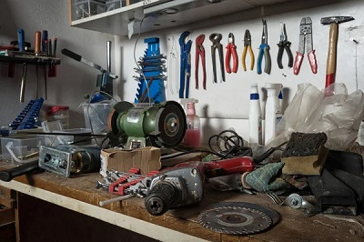
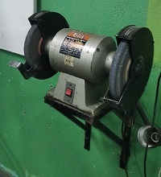
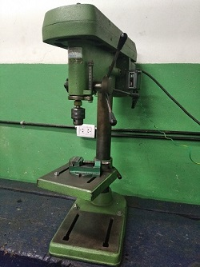
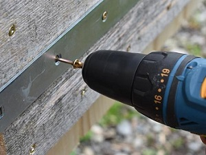
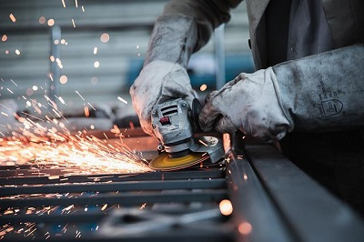
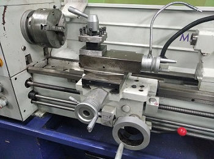
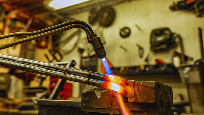
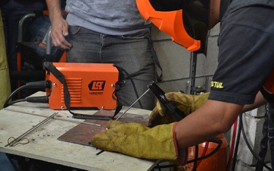
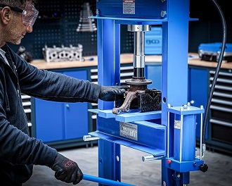

Quiz title: Autoevaluación del módulo: Cuestiones básicas de un taller

Quiz description: Module self-assessment quiz

Text title:  Quiz review – measuring instruments

GROUP

pick: 3
points per question: 1

1. Elige todas las opciones correctas. El Calibre Vernier puede medir:
[*] Diámetros exteriores
[*] Diámetros interiores
[*] Profundidades
[ ] Ángulos
[ ] Planitud

2. Selecciona la opción correcta. ¿Qué herramienta manual corta metal golpeando?
a) Lima
*b) Cortafrío
c) Sierra manual
d) Martillo

3. Elige todas las opciones correctas. Entre las herramientas o máquinas de corte por abrasión encontramos:
[ ] Lima
[*] Amoladora de banco
[*] Lijas
[ ] Buril
[ ] Sierra manual

4. Selecciona la opción correcta. ¿Qué tipo de soldadora utiliza oxígeno y acetileno para fundir el metal?
a) Inverter
*b) Autógena
c) De banco
d) De hilo

5. Elige todas las opciones correctas. Una soldadora inverter funciona:
[*] Mediante arco eléctrico
[*] Fundiendo electrodo y material base
[ ] Usando gases oxígeno–acetileno
[ ] Por abrasión de discos

6. Pon la palabra que falta en minúscula: La soldadura es un proceso que une piezas metálicas por _____ sin necesidad de presión mecánica externa.
* calor
* Calor

7. ¿Cómo se llama el proceso de dar forma a un metal calentándolo al rojo y golpeándolo? Responde con una sola palabra en minúscula.
* Forjado
* fojado
* Forja
* forja

8. Selecciona la opción correcta. ¿Cuál de los siguientes es un equipo auxiliar y no de corte?
a) Amoladora
b) Torno
*c) Morsa
d) Fresadora

END_GROUP

Text title:  Quiz review – Safety and 5s

GROUP

pick: 3
points per question: 1

1. Elige todas las opciones correctas. Trabajar con herramientas, máquinas y materiales sin cuidados puede:
[*] Provocar accidentes
[*] Aumentar el tiempo perdido
[ ] Mejorar la producción
[ ] Hacer el taller más organizado 

2. Elige todas las opciones correctas. La metodología 5S busca:
[*] Mantener el taller limpio y ordenado
[*] Reducir accidentes
[ ] Reducir el salario de los trabajadores
[ ] Aumentar el desorden apuntando a una mayor creatividad 

3. Elige todas las opciones correctas. ¿Qué pasos incluye el método 5S?
[*] Seiri – Clasificar
[*] Seiton – Ordenar
[*] Seiso – Limpiar
[*] Seiketsu – Estandarizar
[*] Shitsuke – Disciplina
[ ] Shunkan – Acelerar
[ ] Shikaku – Diseñar

4. Selecciona la opción correcta. "Seiri" significa:
*a) Separar lo necesario de lo innecesario
b) Ordenar cada cosa en su lugar
c) Limpiar el taller
d) Diferenciar lo correcto de lo incorrecto

5. Selecciona la opción correcta. ¿Cuál es el objetivo de "Shitsuke"? 
*a) Formar el hábito de aplicar las 5S todos los días
b) Mantener reglas simples para que el orden y limpieza se repitan
c) Separar lo necesario de lo innecesario 
d) Ordenar cada cosa en su lugar

6. Selecciona la opción correcta. ¿Cuál es el objetivo de "Seiketsu"? 
a) Separar lo necesario de lo innecesario 
b) Formar hábitos 
*c) Mantener reglas simples para que el orden y limpieza se repitan
d) Hacer reglas para ordenar herramientas

7. ¿Qué palabra japonesa corresponde a formar el hábito de aplicar las 5S todos los días? Responde con la palabra en minúscula.
* shitsuke
* Shitsuke

8. Escribe la palabra japonesa que corresponde a eliminar polvo, restos de material y suciedad. Responde con la palabra en minúscula.
* seiso
* Seiso

9. ¿Cuál es la primera medida de protección?
*a) Ser responsable y cuidadoso, actitud preventiva
b) Usar los EPPs correspondientes
c) Tener la ropa adecuada

10. ¿Cuál es la primera protección que tienes antes de usar un EPP?
*a) Tu actitud esponsable y cuidadosa
b) La ropa de trabajo
c) El casco
d) La iluminación correcta

11. ¿Sobre quién recae la tarea de mantener limpio el taller? 
*a) Sobre todos y cada uno de los que están allí
b) Sobre los supervisores o profesores
c) Sobre los designados para la tarea de limpieza al final de la hora
d) Sobre el personal de limpieza

12. What is your first protection before using an "EPP"?
*a) Your responsible and careful attitude
b) Work clothing
c) The helmet
d) Proper lighting

END_GROUP

Text title: New 5S questions

GROUP

pick: 1
points per question: 1

1. ¿En que puedes notar que este imagen refleja el paso 5s "Seiketsu – Estandarizar"? 
*a) En que hay carteles y flechas indicativas
b) En que está limpio
c) En que se ha separado lo necesario de lo que no lo es
d) En que el piso es verde y limpio

2. ¿En este taller hay más necesidad de "ordenar (Seiton)" o de "clasificar (Seiri)" tirando basura? 
*a) Es más necesario aplicar "Seiton" porque hay varias cosas que sirven pero están desordenadas
b) Es más necesario aplicar "Seiton" porque hay muchas cosas para tirar
c) Es más necesario aplicar "Seiri" porque hay muchad cosas para tirar
d) Es más necesario aplicar "Seiri" porque hay varias cosas que sirven pero están desordenadas

3. ¿Qué es lo más necesario para implementar un sistema 5s en un lugar?
*a) Lograr un cambio cultural de modo que todas las personas estén más convencidas y decididas
b) Conseguir fondos económicos ya que es muy caro implementar 5s
c) Lograr que las autoridades compren lo necesario
d) Poner muchos carteles indicadores y mantener la limpieza

END_GROUP

Text title:  New Epp questions

GROUP

pick: 1
points per question: 1

4. ¿Qué EPP corresponde usar especialmente cuando se manipulan hierros y chapas?
a) Guantes y protector auditivo
b) Guantes para evitar manchar las manos con óxido y aceites
*c) Guantes para proteger especialmente de cortes 
d) Guantes y lentes de seguridad

5. ¿Qué EPP corresponde usar especialmente si se trabaja metales limando y cortando con sierra manual? Elija la mejor opción.
a) Guantes y lentes de seguridad
*b) Ninguno en especial obligatoriamente, pero opcionalmente guantes
c) Guantes y protector auditivo 
d) Ninguno en especial

6. ¿Qué es más importante para la seguridad personal?
a) Usar los EPP que corresponden para evitar accidentes
b) Usar los EPP que corresponden para estar más protegidos si sucede un accidente
*c) Ante todo tener actitud, ser responsable y cuidadoso
d) Cumplir la normativa del lugar en cuanto a los EPP que son obligatorios

END_GROUP

Text title:  New Cleanliness and order questions

GROUP

pick: 1
points per question: 1

7. Los alumnos entran al taller después recreo. En el suelo hay boyo de papel abajo de un torno. Ninguno de los que entran estuvo trabajando en ese torno antes. ¿Qué es lo más correcto?
*a) Que el primero que vea el papel, aunque no lo haya tirado, lo levante y lo tire en el cesto
b) Que el primero que vea el papel avise al profesor para que él le indique a alguien que lo levante
c) De momento no hacer nada ya que al final de la hora los que limpian lo van a levantar
d) Que al que le toque trabajar en ese torno sea el que lo levante

8. Un alumno está cortando una pieza con la sierra manual y por un mal movimiento rompe la hoja. ¿Qué es lo más correcto?
a) Dejar la sierra en el lugar donde se guarda y sacar otra para seguir trabajando
b) Dejarla en la mesa de trabajo y buscar una que esté bien para seguir trabajando
*c) Avisar al profesor de la rotura y estar dispuesto a comprarla y reponerla si así lo indica. Luego dejar la sierra en el lugar que corresponde y si hay otra continuar trabajando.
d) Avisar al profesor de la rotura y estar dispuesto a comprarla y reponerla si así lo indica.

9. Un alumno está usando el taladro de banco. Cuando termina se da cuenta de que ya nadie lo va a usar. ¿Qué es lo más correcto?
*a) Limpiar el taladro y guardar los elementos usados en donde corresponda
b) Guardar las brocas y dejar que al taladro lo limpien los que limpian al final de la hora
c) Limpiar el taladro
d) Avisarle al profesor para que alguien lo limpie

END_GROUP

Text title:  New meassuring, control and marking questions

GROUP

pick: 1
points per question: 1

10. Un alumno está usando un calibre Vernier y se da cuenta de que un tornillito del mismo está flojo. ¿Qué es lo más correcto?
a) Avisar al profesor para que alguien lo ajuste antes de que se pierda
*b) Avisar al profesor y ofrecerse para buscar la herramienta y ajustarlo
c) Guardarlo y buscar otro calibre
d) Seguir usando el calibre y luego avisar al profesor para que alguien lo ajuste

11. ¿Por qué los hay que esmerarse en el trato con los instrumentos de medición?
*a) Porque son delicados y pueden perder precisión por maltratos y golpes
b) Porque hay pocos disponibles
c) Porque no hay repuestos de las partes que se puedan perder
d) Porque pueden oxidarse

END_GROUP

Text title:  New cutting tools and machines

GROUP

pick: 2
points per question: 1

12. ¿Qué máquinas hay a la vista en este taller? 
a) Amoladora angular y taladro portátil
*b) Amoladora de banco y taladro portátil
c) Amoladora angular y taladro de banco
d) Amoladora de banco y taladro de banco

13. ¿Qué máquina es la de la imagen? 
a) Amoladora angular
b) Afiladora de disco
*c) Amoladora de banco
d) Pulidora de disco

14. ¿Qué máquina es la de la imagen? 
a) Taladro manual
b) Taladro automático
*c) Taladro de banco
d) Amoladora de banco

15. ¿Qué máquina se está usando para poner tornillos en la imagen? 
*a) Taladro portátil
b) Taladro de banco
c) Amoladora angular
d) Amoladora de banco

16. ¿Qué máquina es la de la imagen? 
a) Amoladora de banco
b) Taladro portátil
*c) Amoladora angular
d) Esmeril eléctrico

17. ¿Qué máquina es la de la imagen? 
*a) Torno
b) Taladro de banco
c) Amoladora de banco
d) Soldadora inverter
e) Soldadora autoógena

END_GROUP

Text title:  New joining and forming equipment questions

GROUP

pick: 1
points per question: 1

16. ¿Qué máquina es la de la imagen? 
a) Equipo para forjar
*b) Soldadora autógena
c) Soldadora inverter
d) Equipo de corte por plasma

17. ¿Qué máquina es la de la imagen? 
a) Equipo para forjar
b) Soldadora autógena
*c) Soldadora inverter
d) Equipo de corte por plasma
e) Prensa

18. ¿Qué máquina es la de la imagen? 
a) Torno
b) Soldadora autógena
c) Soldadora inverter
d) Taladro de banco
*e) Prensa

END_GROUP
