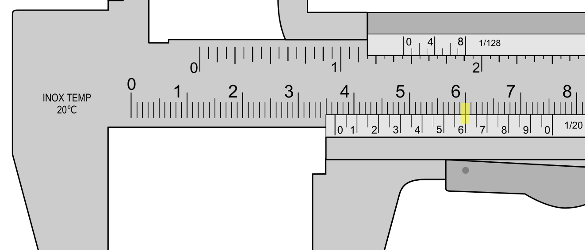

Quiz title: Ejercicio interactivo sobre calibre Vernier

GROUP

1. ▪ Elige todas las opciones correctas. Un calibre Vernier puede medir:
[ ] Ángulos
[*] Diámetros exteriores
[*] Diámetros interiores
[ ] Perpendicularidad

2. ‣ Elige todas las opciones correctas. Un calibre Vernier puede medir: 
[*] Profundidad de agujeros
[ ] Ángulos
[*] La longitud de los lados de una chapa rectangular
[ ] La longitud circular de un caño

3. ⬩ Elige todas las opciones correctas. Un calibre Vernier puede medir:  
[ ] Perpendicularidad
[*] El espesor de una chapa
[ ] La altura de una puerta
[*] El diámtero interior de un caño

END_GROUP

GROUP

1.  ▪ Practice in english. Select a correct option (only one). With a Vernier caliper you can:
a)  Measure angles
*b) Measure diameters
c)  Measure circumferences

2.  ‣ Practice in english. Select a correct option (only one). With a Vernier caliper you can:
*a) Measure hole depth
b)  Measure angles
c)  Measure temperatures

END_GROUP

GROUP

1. ▪ ¿Qué medida muestra este calibre? Escribe un número con un solo decimal. 
* 3,3
* 3.3

2. ‣ ¿Qué medida muestra este calibre? Escribe un número con un solo decimal. 
* 4,4
* 4.4

3. ⬩ ¿Qué medida muestra este calibre? Escribe un número con un solo decimal. 
* 5,8
* 5.8
END_GROUP

GROUP

1. ▪ ¿Qué medida muestra este calibre? Escribe un número con un solo decimal. 
* 8,2
* 8.2

2. ‣ ¿Qué medida muestra este calibre? Escribe un número con un solo decimal. 
* 12,7
* 12.7

3. ⬩ ¿Qué medida muestra este calibre? Escribe un número con un solo decimal. 
* 14,3
* 14.3

END_GROUP

GROUP

1. ▪ ¿Qué medida muestra este calibre? Escribe un número con un solo decimal. 
* 32,2
* 32.2

2. ‣ ¿Qué medida muestra este calibre? Escribe un número con un solo decimal. 
* 34,1
* 34.1

3. ⬩ ¿Qué medida muestra este calibre? Escribe un número con un solo decimal. 
* 36,6
* 36.6

END_GROUP

GROUP

1.  Selecciona la opción correcta. Si pones un calibre parado y bien apoyado sobre una mesa plana y luego, sin levantarlo, logras abrir un poco las mordazas significa que:
*a) Hay un problema o falla en la varilla de profundidad
b)  Hay un problema o falla en las mordazas para exteriores
c)  Hay un problema o falla en las mordazas para interiores

2.  Si cierras el calibre totalmente y aun así se ve luz a través de las mordazas para exteriores significa que:
*a) Hay que limpiar las mordazas o puede tener una falla
b)  El calibre está bien y es normal
c)  La varilla de profundidad tiene una falla o problema

3.  Selecciona todas las opciones correctas. Si cierras el calibre totalmente y no coinciden el cero del nonio con el cero de la regla fija significa que:
*a) Hay alguna falla o desgaste y no conviene usarlo
b)  No representa un problema ya que es lo normal
c)  La varilla de profundidad tiene una falla o problema

END_GROUP

