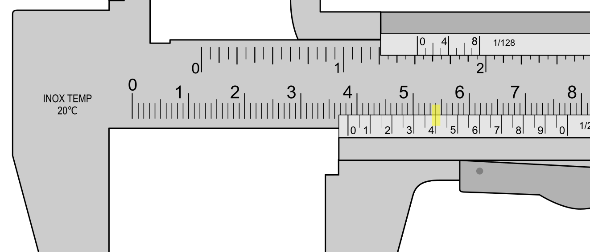

Quiz title: Autoevaluación de medicón con calibre Vernier

GROUP

1. ▪ ¿Qué medida muestra este calibre? Escribe un número con un solo decimal. 
* 14,5
* 14.5

2. ‣ ¿Qué medida muestra este calibre? Escribe un número con un solo decimal. 
* 17,2
* 17.2

3. ⬩ ¿Qué medida muestra este calibre? Escribe un número con un solo decimal. 
* 19,9
* 19.9

END_GROUP

GROUP

1. ▪ ¿Qué medida muestra este calibre? Escribe un número con un solo decimal. 
* 20,6
* 20.6

2. ‣ ¿Qué medida muestra este calibre? Escribe un número con un solo decimal. 
* 22,5
* 22.5

3. ⬩ ¿Qué medida muestra este calibre? Escribe un número con un solo decimal. 
* 25,4
* 25.4

END_GROUP

GROUP

1. ▪ ¿Qué medida muestra este calibre? Escribe un número con un solo decimal. 
* 27,8
* 27.8

2. ‣ ¿Qué medida muestra este calibre? Escribe un número con un solo decimal. 
* 29,3
* 29.3

3. ⬩ ¿Qué medida muestra este calibre? Escribe un número con un solo decimal. 
* 31,3
* 31.3

4. ▫ ¿Qué medida muestra este calibre? Escribe un número con un solo decimal. 
* 38,4
* 38.4

END_GROUP

